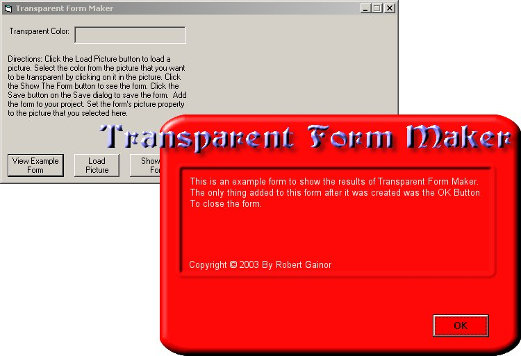



## A Transparent Form Maker

### Description

This application creates transparent forms. Just Load a picture into the app, select the color that you want to be transparent, Click the "Show The Form" button. Save the form from the "Save Form" dialog that appears when the form is shown. All you need to do then is add the form to your project and set the Picture property to the picture that you used in the application. An example picture and form is provided for you to see the output. I wrote this program out of a need to have fast loading Transparent forms. Most of the code here that does Transparent forms takes about five seconds for the form to load. What this program does is it creates a region and saves the region data to a .frm file that you can then add to a Visual Basic Project.
 
### More Info
 

             |
---                |---
**Submitted On**   |2003-12-11 01:11:20
**By**             |[Robert Gainor](https://github.com/Planet-Source-Code/PSCIndex/blob/master/ByAuthor/robert-gainor.md)
**Level**          |Intermediate
**User Rating**    |4.2 (88 globes from 21 users)
**Compatibility**  |VB 6\.0
**Category**       |[Complete Applications](https://github.com/Planet-Source-Code/PSCIndex/blob/master/ByCategory/complete-applications__1-27.md)
**World**          |[Visual Basic](https://github.com/Planet-Source-Code/PSCIndex/blob/master/ByWorld/visual-basic.md)
**Archive File**   |[A\_Transpar16827012112003\.zip](https://github.com/Planet-Source-Code/robert-gainor-a-transparent-form-maker__1-50405/archive/master.zip)

